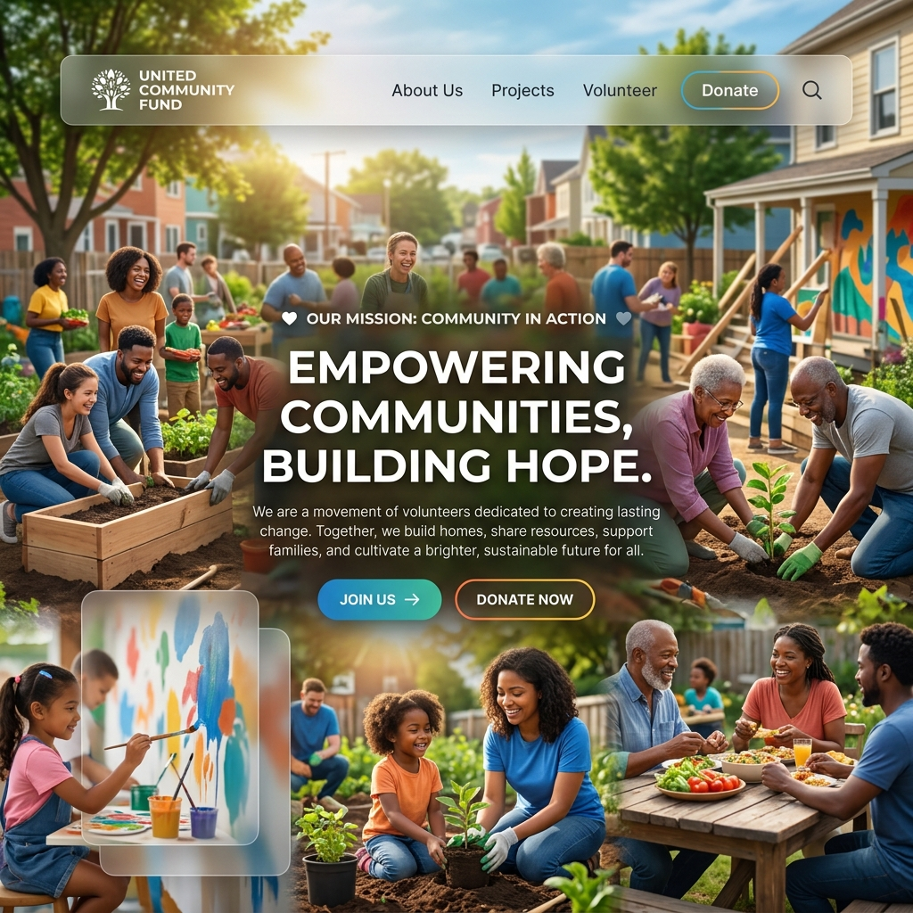
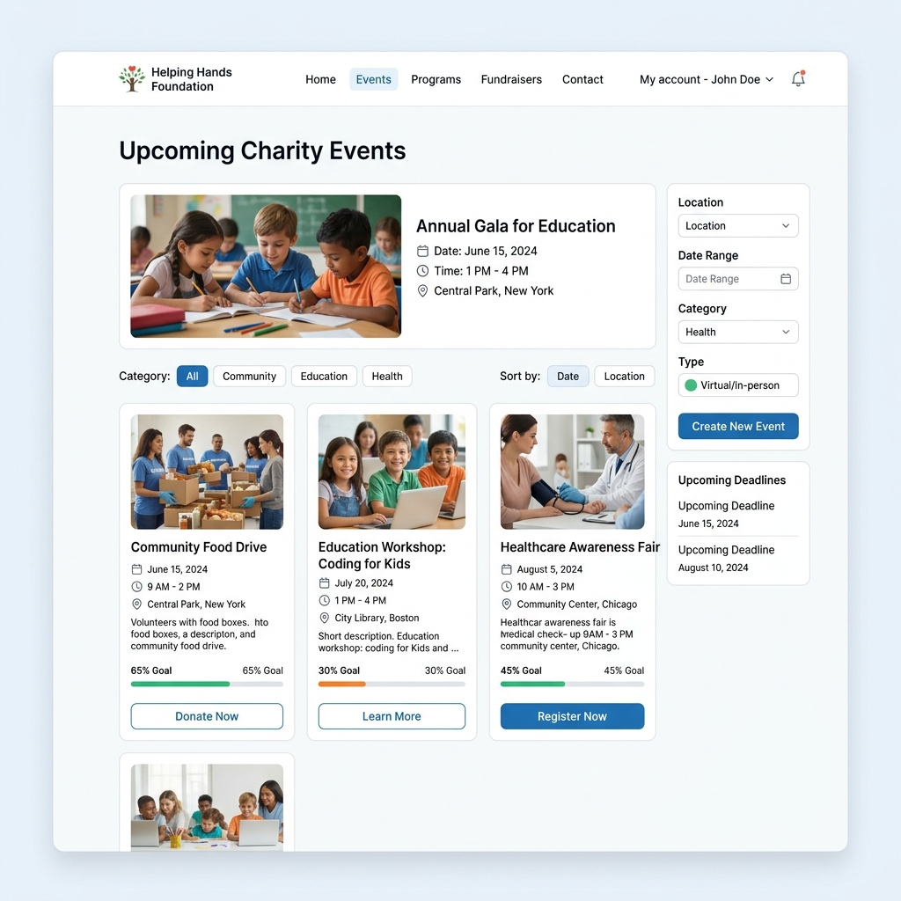
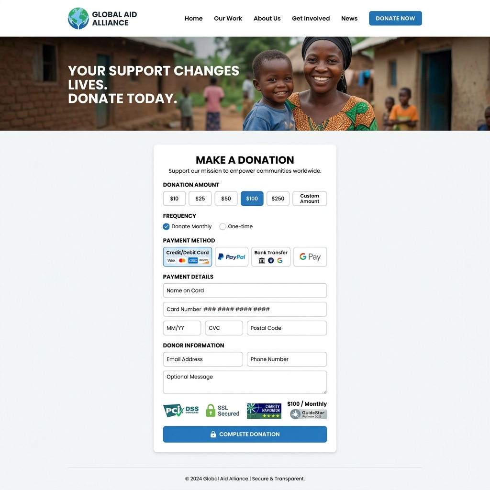
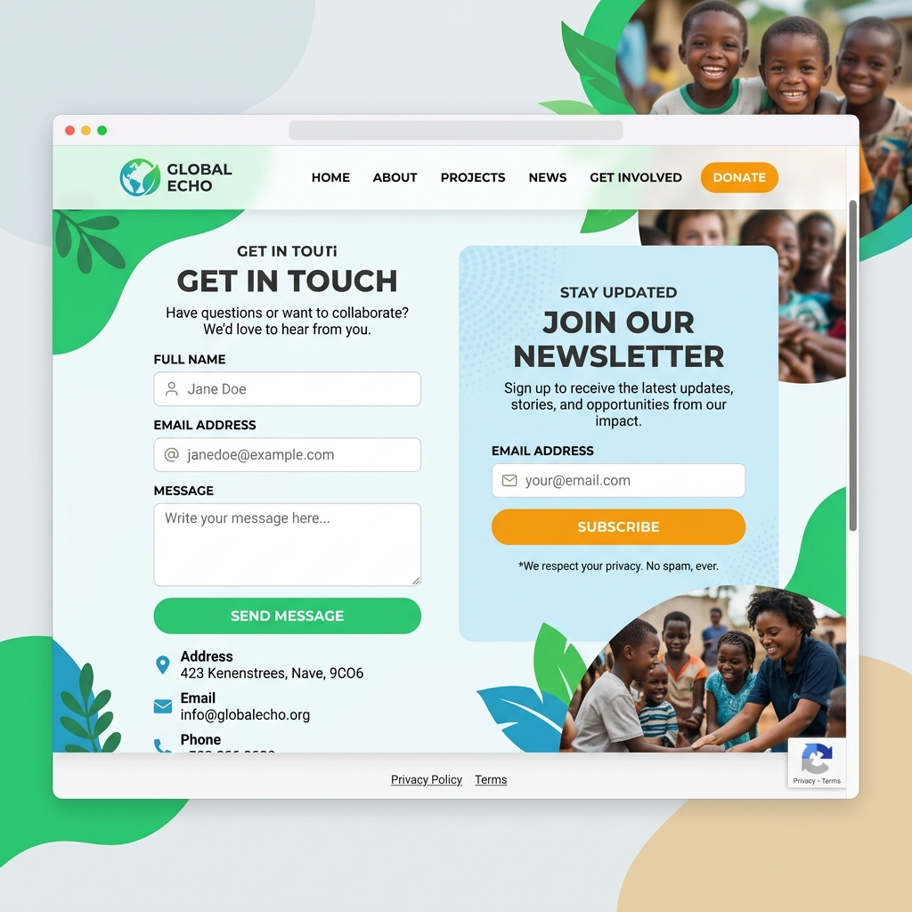

# 🌟 InAmigos Foundation Internship

Welcome to the central repository for my internship projects at the **InAmigos Foundation**. This repository chronicles my journey as a web development intern, showcasing the various projects and tasks I have completed. Our mission is to build robust, scalable, and visually stunning web applications that empower communities and streamline non-profit operations.

<div align="center">
  
</div>

---

## 📂 Project Overview

During this internship, I focused on developing modern, accessible, and responsive web interfaces tailored for NGO activities. The projects span from basic web development to advanced, dynamic web applications utilizing the latest tech stacks.

### 🎯 Core Objectives
- **Community Empowerment**: Designing interfaces that make donating, volunteering, and event participation seamless.
- **Admin Efficiency**: Creating powerful dashboards for the internal team to manage resources and track progress.
- **Modern Aesthetics**: Implementing glassmorphism, responsive design, and intuitive UX/UI principles.

---

## 🖼️ Featured UI Showcases

Here are some of the key interfaces developed during this internship:

### 1. 📅 Event Management System
A clean and accessible interface for users to discover and register for upcoming community events and workshops.
<div align="center">
  
</div>

### 2. 📊 Admin Dashboard
A sleek, dark-mode analytics dashboard designed for the NGO's administrative team to track donations, volunteer hours, and project milestones.
<div align="center">
  
</div>

### 3. 💝 Secure Donation Portal
A trustworthy, multi-option payment gateway interface designed to facilitate seamless contributions from global donors.
<div align="center">
  
</div>

### 4. 📬 Community Outreach & Newsletter
A vibrant contact and subscription section to keep the community engaged and informed about the latest impact stories.
<div align="center">
  
</div>

---

## 🚀 Directory Structure

This repository is organized into distinct tasks, each representing a milestone in the internship program.

### [Task 1: Basic Web Development](./Task1)
A comprehensive static web application featuring an event management layout, professional theming, and an admin dashboard. Focuses on foundational HTML/CSS/JS with a strong emphasis on UI/UX for non-profits.

### [Task 3: Neoverse AI Landing Page](./Taks3)
A futuristic AI startup landing page built to look like a premium 2035-era product showcase, utilizing modern frameworks and animations.

---

## 💻 Getting Started

To explore a specific project, navigate to its directory and refer to its local `README.md` for setup instructions.

```bash
# Clone the repository
git clone https://github.com/yourusername/InAmigos-ngo-webpage.git

# Navigate to a specific task
cd "InAmigos Intern"/Task1

# Open the project in your browser or editor
```

---
*Developed with ❤️ as part of the InAmigos Foundation Internship Program.*
