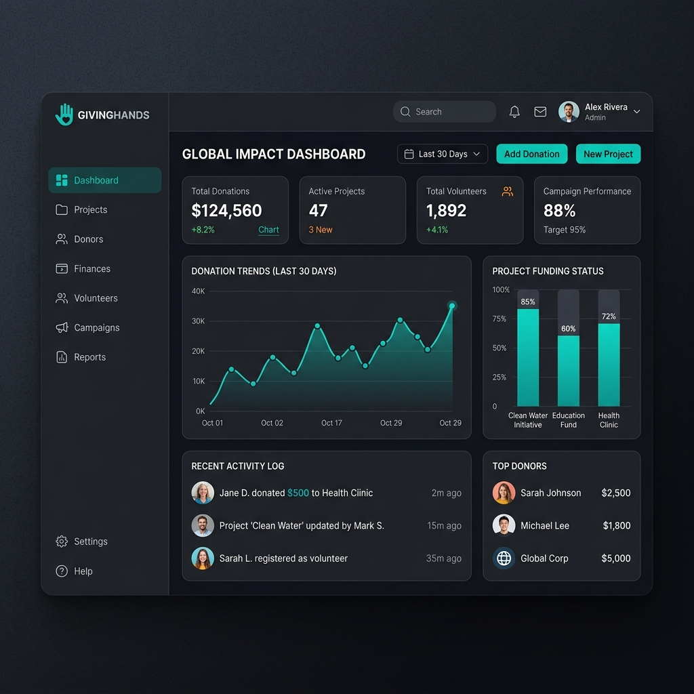

# 🌍 Task 1: InAmigos NGO Web Platform

Welcome to **Task 1** of the InAmigos Foundation Internship! This project focuses on building a professional, responsive, and aesthetically pleasing static web application tailored for a Non-Governmental Organization (NGO). 

<div align="center">
  
</div>

---

## 🎯 Project Focus

The primary objective of this task is to demonstrate proficiency in core web technologies (HTML, CSS, JavaScript) by creating a comprehensive web presence for an NGO. The platform includes public-facing pages for community engagement and a secure administrative dashboard for internal management.

### Key Features
- **Responsive Design**: Ensures a seamless experience across desktop, tablet, and mobile devices.
- **Event Management Layout**: A dedicated section for upcoming charity events and volunteer opportunities.
- **Admin Dashboard**: A customized layout for managing platform data and analytics.
- **Professional Aesthetics**: Utilizes modern UI trends like glassmorphism, clean typography, and a harmonious color palette.

---

## 🖼️ Platform Gallery (5 Project Images)

Here is a visual walkthrough of the key components developed for this task:

### 1. The Hero Section (Community First)
A welcoming landing page that highlights the NGO's mission and encourages immediate engagement.
<div align="center">
  
</div>

### 2. Event Discovery & Registration
An intuitive layout for users to find events, read details, and register as volunteers.
<div align="center">
  
</div>

### 3. Administrative Control Center
A sophisticated dark-mode dashboard providing administrators with crucial metrics and quick actions.
<div align="center">
  
</div>

### 4. Streamlined Donation Process
A secure and user-friendly donation form supporting various payment methods and frequencies.
<div align="center">
  
</div>

### 5. Newsletter & Community Contact
A vibrant interface designed to capture leads, answer queries, and grow the NGO's subscriber base.
<div align="center">
  
</div>

---

## 🛠️ Technology Stack
- **HTML5**: Semantic structure and accessibility.
- **CSS3**: Custom styling, flexbox/grid layouts, and responsive media queries.
- **Vanilla JavaScript**: DOM manipulation, interactive components, and form validation.

## 🚀 How to Run

This project is built using static files, making it incredibly easy to run locally.

1. **Navigate to the Task 1 directory:**
   ```bash
   cd Task1
   ```
2. **Launch the Application:**
   Simply open `index.html` in your preferred web browser. You can also use a local server like Live Server in VS Code for a better development experience.
   
3. **Access the Admin Panel:**
   Open `admin.html` to view the administrative dashboard.

---
*Built for the InAmigos Foundation Internship.*
